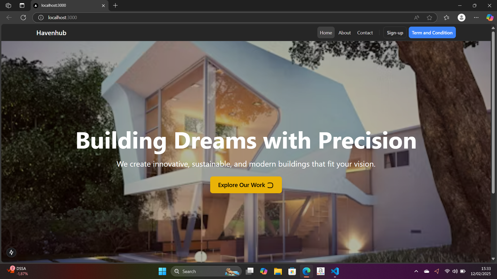
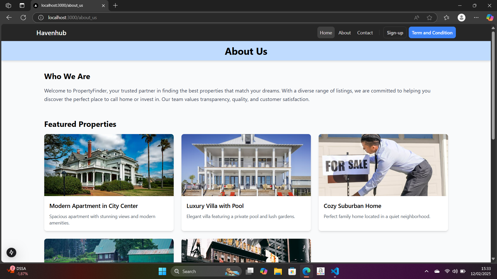
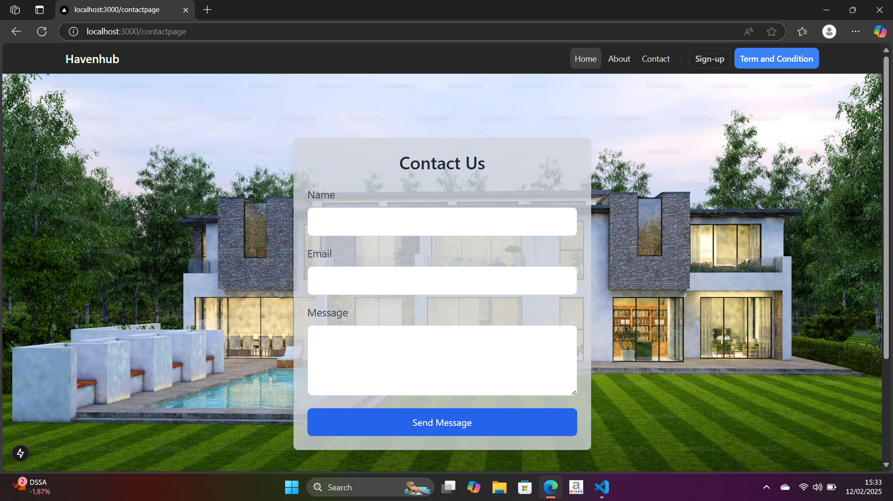
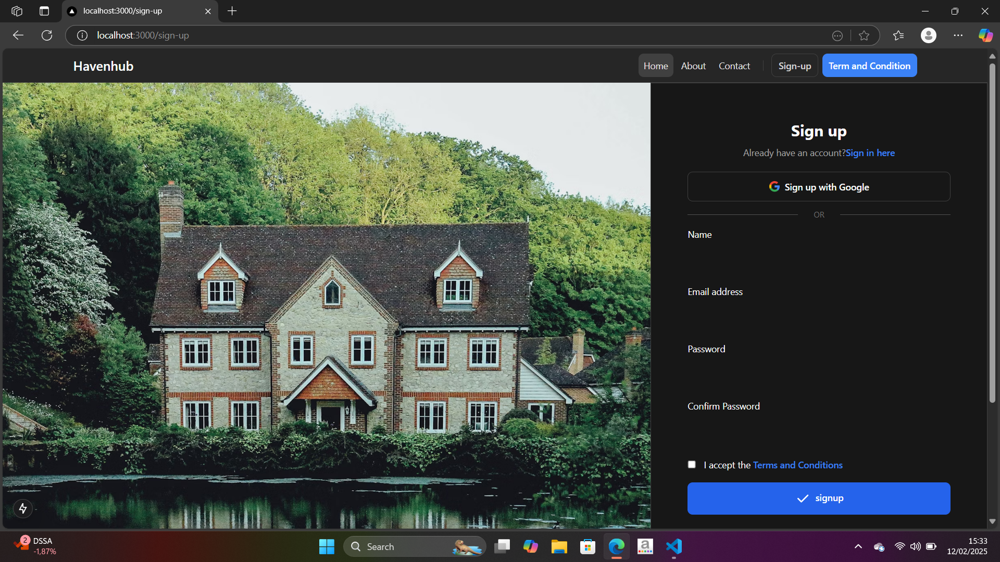
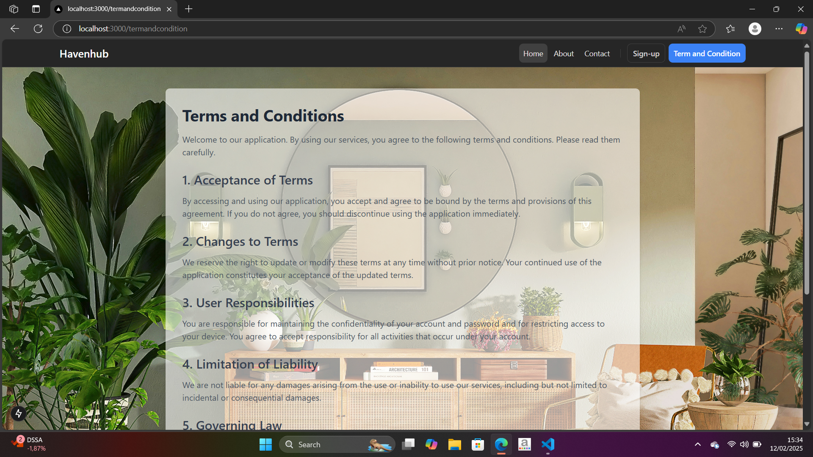
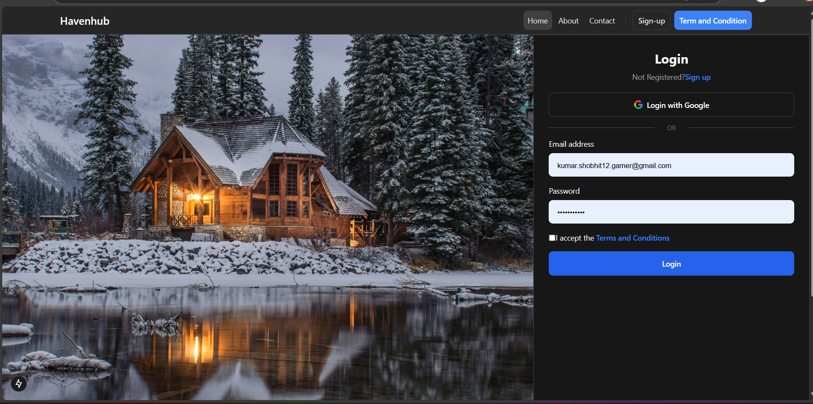

Property Dealing Website 🏡

A full-stack MERN web application for property listing, buying, and selling. Users can browse properties, create accounts, post listings, and contact sellers.

📸 Project Screenshot-

Features-

✔ User authentication (Sign-up, Login, JWT-based Auth)

✔ List, edit, and delete properties

✔ Search and filter properties

✔ Contact property owners

✔ Responsive UI with Material UI/Bootstrap

✔ Secure API with Express.js

Tech Stack-

Frontend: React.js, Redux, Material UI

Backend: Node.js, Express.js

Database: MongoDB, Mongoose

Authentication: JWT, bcrypt

Hosting: Vercel (Frontend), Render/Heroku (Backend)
